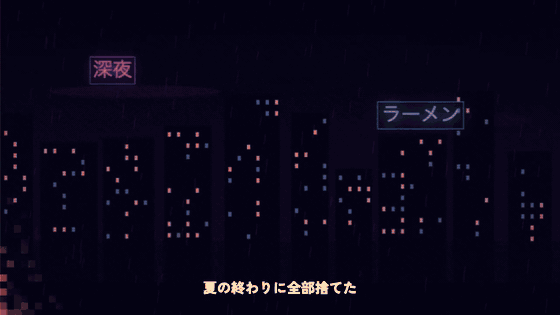
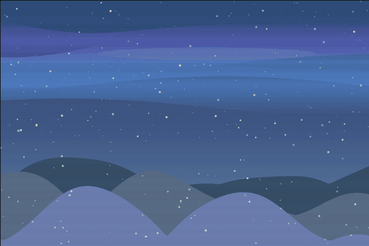
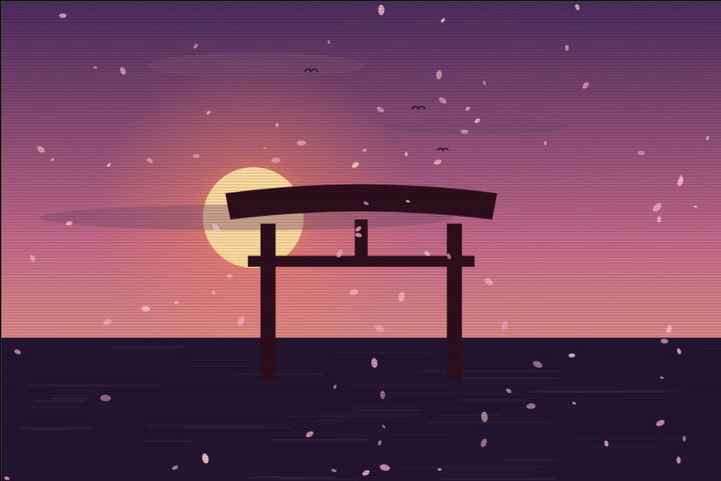
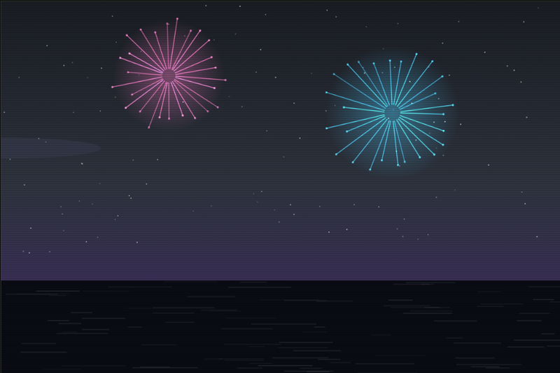
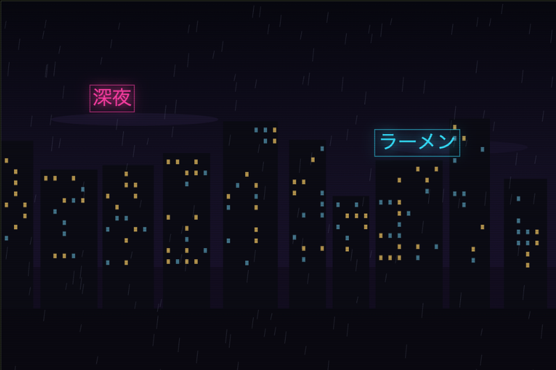
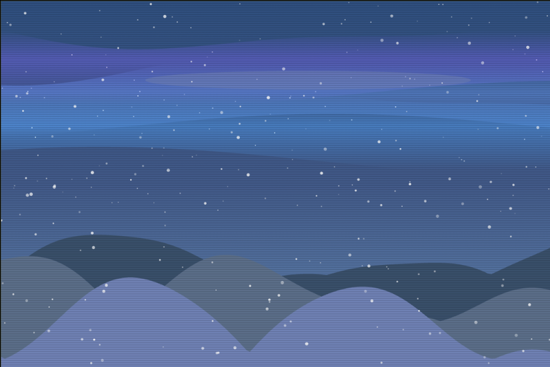

# NOIZ LAB — 画像エフェクト実験室

ブラウザ内 (WebGL2) で完結する、Y2K / グリッチ系の画像エフェクトWebアプリ。
Cloudflare Workers (静的アセット + Workers AI) でホスティングしています。

**URL**: https://image-effector.pregum-dev.workers.dev



## 作例（AIシーン生成）

日本語プロンプト → llama-3.3-70bがシーン仕様を設計 → Canvasがベクター風に描画。



| 「桜舞う神社の参道、夕暮れ」 | 「夏祭りの夜、湖の上に上がる花火」 |
|---|---|
|  |  |
| **「雨のネオン街、看板は『深夜』と『ラーメン』」** | **「オーロラの下の雪原と山」** |
|  |  |

## 概要

SNSで流行しているグリッチ加工・ピクセルソート・ディザ/ハーフトーン・CRT/VHS風加工などを、
ブラウザだけでリアルタイムに適用・保存できる実験室。エフェクトは機材ラック風のUI（EFFECT RACK）で
個別にON/OFF・パラメータ調整でき、プリセットからワンタップで雰囲気を作れます。

- 画像処理はすべてクライアント側 (WebGL2 シェーダー + Canvas) で完結し、画像はサーバーへ送信されない
- 元画像がなくても Workers AI (FLUX.1 schnell) でテキストから生成してそのまま加工できる

## 機能

| カテゴリ | 内容 |
|---|---|
| エフェクト | ぼかし / ピクセルソート / グリッチ / RGBずらし(色収差) / ハレーション / **色調エモ化**(色温度・フェード・ティール&オレンジ・彩度・コントラスト) / **光漏れ** / モザイク / ベイヤーディザ・ハーフトーン / CRT湾曲・走査線 / グレイン・ビネット |
| プリセット | Y2K / VHS / DREAM / PRINT / PIXEL / SORTED / **CINEMA / FILM / NEON** + おまかせ(ランダム)。URLハッシュで直リンク可（例: `/#preset=CINEMA`） |
| AI生成（写真） | Workers AI (FLUX.1 schnell)。日本語プロンプトは llama-3.1-8b-fp8 で英訳してから生成 |
| AI生成（シーン） | llama-3.3-70b がテキストからシーン仕様(JSON)を設計し、ブラウザがCanvasでベクター風イラストとして描画。サンプル画像と同じ「味」をテキストから量産できる。モチーフ: 空/太陽/月/星/雲/海/グリッド/山/街/雨/雪/桜/花火/オーロラ/鳥居/ネオン看板/鳥 |
| 文字入れ | サムネ用タイトル文字（`\|`で改行、フォント3種・色4種・自由配置・ドラッグ移動）。グリッチの影響を受けず、CRT・粒子には馴染む合成。レシピに含まれ再現可能 |
| 重ね画像 | 2枚目の画像をソース段階で合成するコラージュ。サイズ・不透明度・ブレンド4種・ドラッグ移動。合成後の全体にエフェクトがかかる |
| トランジション | 画像A→Bをフェード / ワイプ / ディゾルブ / グリッチワイプでつなぎ、エフェクトごとWebM動画として書き出し（MediaRecorderでリアルタイム録画） |
| 入出力 | ドラッグ&ドロップ / ファイル選択 / クリップボード貼り付け読み込み。PNG保存は 元 / 16:9 / 1:1 / 9:16 の中央クロップ書き出し対応（画面にガイド表示） |
| シェア | Xシェアボタン + OGP画像・Twitter Card対応 |
| サンプル | プロシージャル自作のサンプル画像8種（手描き4種 + シーン仕様4種: 桜×鳥居 / 花火 / 雨のネオン街 / オーロラ雪原）。「◧ サンプル」で切替、`/#sample=N`で直リンク可 |
| ギャラリー | 作品（元画像+エフェクトレシピ）をR2+D1に保存し、いつでも読み込んで再編集。アクセスキーで保護 |
| ナレッジグラフ | 保存作品をノードにした2D/3Dフォースグラフ。llavaキャプション+bge-m3埋め込みによる意味類似とレシピ類似でエッジを自動生成 |
| 掛け合わせ | ノードを2つ選んでレシピを交叉（補間+ノイズ）した子作品を生成。単ノードは突然変異。親子関係は系譜エッジ（マゼンタ破線）で可視化 |
| 保護 | AI生成5回/分・ギャラリー保存10回/分・埋め込み解析20回/分のIPごとレート制限 (Durable Objects)、無料枠超過時は503で案内 |

## 構成

```
public/          静的アセット (index.html / style.css / app.js)
  app.js         WebGL2パイプライン・エフェクトラックUI・ピクセルソート(CPU)・ギャラリーUI
src/worker.js    /api/generate (Workers AI) + /api/works (ギャラリー) + レート制限DO + アセット配信
schema.sql       D1スキーマ (works テーブル)
wrangler.jsonc   Workers設定 (AI / D1 / R2 / Durable Objects / assets バインディング)
docs/demo.gif    デモ
```

ギャラリーの認証キーは Workers の secret (`GALLERY_KEY`)。
ローテーションは `npx wrangler secret put GALLERY_KEY`、ローカル開発時は `.dev.vars` に記載する。

レンダリングは「元画像(＋CPUピクセルソート) → 分離ガウシアンブラー → 輝度抽出+ブラー(ハレーション) →
最終合成シェーダー(グリッチ/色収差/ディザ/CRT/グレイン)」のマルチパス構成。

## 開発・デプロイ

```sh
npx wrangler dev      # ローカル開発 (http://localhost:8787)
npx wrangler deploy   # デプロイ (pregum.dev アカウントにログインしていること)
```

## ロードマップ

### ビジュアル・ナレッジグラフ構想（作品の系譜 + 類似空間）
作った1枚をノードとして貯め、グラフ上で「近い作品」を眺めたり、
2作品を掛け合わせて新しい作品を生む方向に育てる。

- [x] Phase 1: 作品ギャラリー（元画像+レシピをR2/D1に保存、読み込み再編集）
- [x] Phase 2: 類似グラフ（llavaキャプション→bge-m3埋め込み、自前フォースシミュレーションで2D/3D表示）
- [x] Phase 3: 掛け合わせ（レシピ交叉・突然変異）と系譜エッジの記録・表示
- [ ] Phase 4候補: 元画像側の掛け合わせ（AI img2img）、グラフの構造的な穴からの「次に作ると良い作品」提案

### 近いうち
- [x] サムネイル用テキスト入れ（タイトル文字・フォント選択）
- [x] 16:9 / 1:1 / 9:16 のクロップ書き出し（ガイド表示つき）
- [x] OGP画像・Xシェアボタン
- [ ] エフェクト設定のURL共有（クエリパラメータにシリアライズして再現可能に）
- [ ] エフェクト追加: ASCIIアート化 / VHSトラッキングノイズ / 走査線ゆらぎ / LUTカラーグレーディング
- [ ] モバイルUIの調整（ラックのタッチ操作性）

### そのうち
- [x] WebM書き出し（トランジション動画として実装）
- [ ] GIF / MP4書き出し（X投稿用。ブラウザ内エンコーダの導入が必要）
- [ ] エフェクトの並び替え（ラックの順序をドラッグで入れ替えて適用順を変更）
- [ ] AI img2img（手持ち画像をAIでスタイル変換してから加工）
- [ ] PWA対応（オフラインでもエフェクトのみ利用可能に）

### 検討中
- [ ] Turnstile導入（AI生成APIのbot対策強化）
- [ ] プリセットのユーザー保存・共有ギャラリー
- [ ] 独自ドメイン化
